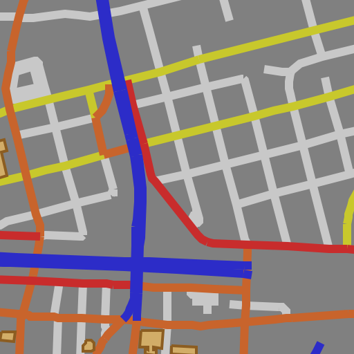
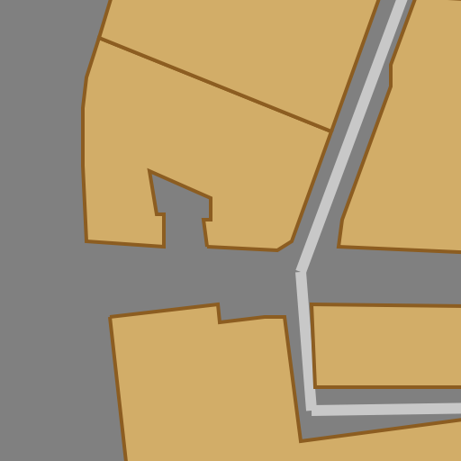

**A simple and efficient tile renderer**

**Input:** [Tiledata](https://github.com/ReclaimSoftware/RSTiledata)

**Output:** 512x512 {PNG,BMP} (@2X resolution assumed.)

### POSIX
    TODO

### iOS
    TODO

### Mac CLI
    cat test/tiledata/15-kc-mo9-merge | tile-renderer-mac --zoom 15 --format png > tile.png

### License: TBD

I haven't decided on (permissive) vs (copyleft + CLA) yet. All rights reserved for now.

### Examples

<table>
  <tr>
    <td></td>
    <td></td>
  </tr>
</table>